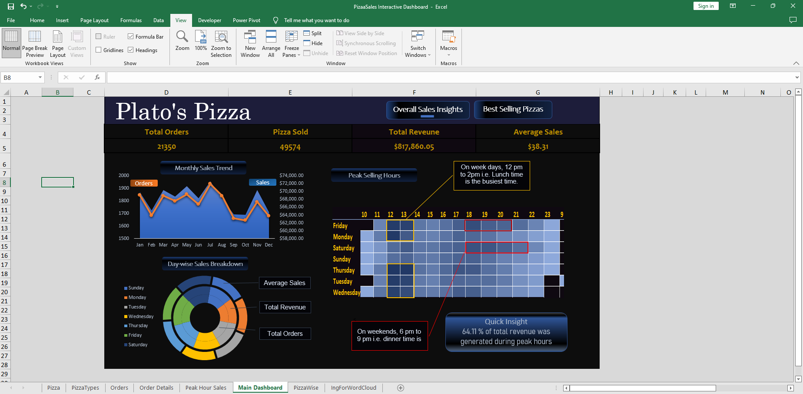

# Data-Modeling-and-Interactive-Dashboarding-using-Excel
### Aim of the project:
- Analysis of a Pizza sales dataset to find out sales insights.
- Data modeling using Power Pivot in Excel.
- Exploring Excel features to accomplish a data analysis project entirely in Excel.

### Used tools:
- Excel Power Query- For data loading.
- Power Pivot in Excel - For data modeling.
- DAX - For data analysis.
- Excel Charts, Pivot Tables and Pivot Charts - To design an interactive dashboard.

### Experience gained:
Data Integration, Data Modelling, Interactive Dashboarding

### Final Output:
Dashboard in Excel

https://user-images.githubusercontent.com/76909183/201522063-2541e8e9-8664-465c-8b05-79beb66948dc.mp4

The dashboard is entirely designed in Excel.

## Detailed Description
### Contents of the repository
[1. Used dataset](https://github.com/shakhscode/Data-Modeling-and-Interactive-Dashboarding-using-Excel/blob/main/README.md#1-used-dataset)

[2. Data cleaning & Transformation ](https://github.com/shakhscode/Data-Modeling-and-Interactive-Dashboarding-using-Excel/blob/main/README.md#2-data-cleaning--transformation)

[3. Data Modeling](https://github.com/shakhscode/Data-Modeling-and-Interactive-Dashboarding-using-Excel/blob/main/README.md#3-data-modelling)

[4. DAX Calculations](https://github.com/shakhscode/Data-Modeling-and-Interactive-Dashboarding-using-Excel/blob/main/README.md#4-dax-calculations)

[5. Designing an Interactive Dashboard](https://github.com/shakhscode/Data-Modeling-and-Interactive-Dashboarding-using-Excel/blob/main/README.md#5-designing-an-interactive-dashboard)

### 1. Used dataset
### 2. Data cleaning & Transformation
### 3. Data Modelling
### 4. DAX Calculations
Total Sales = Order Quantity * Price per pizza
=order_details[quantity]*RELATED(pizzas[price])

Day and Month Name from the date column
Day :=FORMAT([date], "DDDD")
Month :=FORMAT([date], "MMM")

### 5. Designing an Interactive Dashboard
