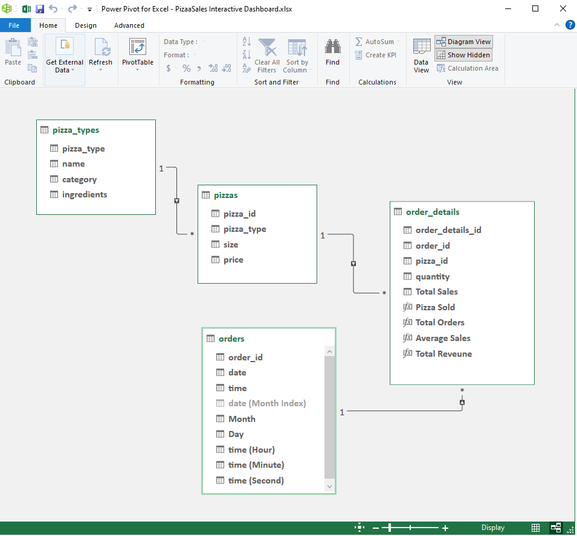

# Data-Modeling-and-Interactive-Dashboarding-using-Excel
### Aim of the project:
1. Analysis of a Pizza sales dataset to find out insights like 
- Monthly sales trend. 
- Whether sales was higher on weekdays or weekends ?
- Peak time on a day when highest orders were received ? 
- Best selling pizzas and lowest selling pizzas etc.
2. Learning data modeling using Power Pivot in Excel.
3. Exploring Excel features to accomplish a data analysis project entirely in Excel.

### Used tools:
- Excel Power Query- For data loading.
- Power Pivot in Excel - For data modeling.
- DAX - For data analysis.
- Excel Charts, Pivot Tables and Pivot Charts - To design an interactive dashboard.

### Experience gained:
Data Integration, Data Modelling, Interactive Dashboard designing.

### Final Output:
Dashboard in Excel


https://user-images.githubusercontent.com/76909183/201522063-2541e8e9-8664-465c-8b05-79beb66948dc.mp4


The dashboard is entirely designed in Excel.


## Detailed Description
### Contents of the repository
[1. Data description](https://github.com/shakhscode/Data-Modeling-and-Interactive-Dashboarding-using-Excel/blob/main/README.md#1-dataset-description)

[2. Data Modeling](https://github.com/shakhscode/Data-Modeling-and-Interactive-Dashboarding-using-Excel/blob/main/README.md#2-data-modelling)

[3. DAX Calculations](https://github.com/shakhscode/Data-Modeling-and-Interactive-Dashboarding-using-Excel/blob/main/README.md#3-dax-calculations)

[4. Designing an Interactive Dashboard](https://github.com/shakhscode/Data-Modeling-and-Interactive-Dashboarding-using-Excel/blob/main/README.md#4-designing-an-interactive-dashboard)

### 1. Dataset description 
The dataset is collected from [Maven Analytics](https://www.mavenanalytics.io/data-playground). It contains sales records of a pizza store for the year 2015. It has
- 4 tables.
- 12 dimensions.
- 48620 instances.

### 2. Data Modelling
Data was integrated using Power Pivot add-on in Excel.
'Order_details' table is the star schema and 'pizza_types' table is a snowflake.




### 3. DAX Calculations

Total orders placed in the year 2015.
```
Total Orders:=DISTINCTCOUNT(order_details[order_id])
```

Total sales per order.

**Total Sales = Order Quantity * Price per pizza**

To calculate this we need to multiply coulmns from different table. So RELATED() function is used.

```
Total Sales =order_details[quantity]*RELATED(pizzas[price])
```
Total Revenue in 2015
```
Total Revenue := SUM([Total Sales])
```
Average sales per order
```
Average Sales:=DIVIDE([Total Reveune],[Total Orders],0)
```

Total pizza sold
```
Pizza Sold:=SUM(order_details[quantity])
```

#### To visualize monthly and weekly sales insights month and weekdays were extracted from the date using FORMAT() function
Day and Month Name from the date column
```
Day :=FORMAT([date], "DDDD")
Month :=FORMAT([date], "MMM")
```


### 4. Designing an Interactive Dashboard

- All the charts added to the dashboard are created using pivot tables and pivot charts. And a slicer is used make the dashboard interactive. 
- To visualize top and worst selling pizzas a value filter is used in the pivot charts.
- Two dashboards are connected using a hyperlink.

